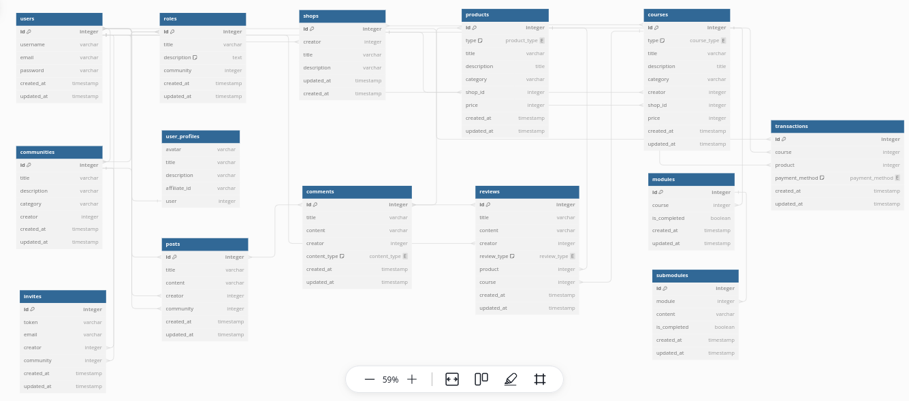

# Database Schema

 

```
Table shops {
  id integer [primary key]
  creator integer
  title varchar
  description varchar
  updated_at timestamp
  created_at timestamp 
}

Enum product_type {
  document
  video
  audio
  image
}

Table products {
  id integer [primary key]
  type product_type
  title varchar
  description title
  category varchar
  shop_id integer
  price integer
  created_at timestamp
  updated_at timestamp
}

Table users {
  id integer [primary key]
  username varchar
  email varchar
  password varchar
  created_at timestamp
  updated_at timestamp
}

Table user_profiles {
  avatar varchar
  title varchar
  description varchar
  affiliate_id varchar
  user integer
}

Table roles {
  id integer [primary key]
  title varchar
  description text [note: 'Content of the post']
  community integer
  created_at timestamp
  updated_at timestamp
}

Table communities {
  id integer [primary key]
  title varchar
  description varchar
  category varchar
  creator integer
  created_at timestamp
  updated_at timestamp
}

Table invites {
  id integer [primary key]
  token varchar
  email varchar
  creator integer
  community integer
  created_at timestamp
  updated_at timestamp
}

Table posts {
  id integer [primary key]
  title varchar
  content varchar
  creator integer
  community integer
  created_at timestamp
  updated_at timestamp
}

Enum content_type {
  reviews
  posts
  products
}

Table comments {
  id integer [primary key]
  title varchar
  content varchar
  creator integer
  content_type content_type
  created_at timestamp
  updated_at timestamp
}

Enum review_type {
  product
  course
}

Table reviews {
  id integer [primary key]
  title varchar
  content varchar
  creator integer
  review_type review_type
  product integer
  course integer
  created_at timestamp
  updated_at timestamp
}

Enum course_type {
  blog
  video
}

Table courses {
  id integer [primary key]
  type course_type
  title varchar
  description title
  category varchar
  creator integer
  shop_id integer
  price integer
  created_at timestamp
  updated_at timestamp
}

Table modules {
  id integer [primary key]
  course integer  
  is_completed boolean
  created_at timestamp
  updated_at timestamp
}

Table submodules {
  id integer [primary key]
  module integer
  content varchar  
  is_completed boolean
  created_at timestamp
  updated_at timestamp
}

Enum payment_method {
  mobile
  paypal
  stripe
  bank_transfer
}

Table transactions {
  id integer [primary key]
  course integer
  product integer
  payment_method payment_method
  created_at timestamp
  updated_at timestamp
}

Ref user_roles: users.id <> roles.id 

Ref community_roles: communities.id <> roles.id 

Ref community_members: users.id <> communities.id

Ref: users.id < shops.creator

Ref: users.id < posts.creator

Ref: communities.id < posts.community

Ref: users.id < invites.creator

Ref: communities.id < invites.community

Ref: shops.id < products.shop_id

Ref post_likes: users.id <> posts.id

Ref product_comments: products.id <> comments.id

Ref post_comments: posts.id <> comments.id

Ref review_comments: reviews.id <> comments.id

Ref: reviews.creator > users.id

Ref: reviews.product > products.id

Ref shop_course: shops.id <> courses.id

Ref: users.id < courses.creator

Ref: shops.id < courses.shop_id

Ref: reviews.course > courses.id

Ref: modules.course > courses.id

Ref: submodules.module > modules.id

Ref: users.id > user_profiles.user

Ref user_transactions: transactions.id <> users.id

Ref: transactions.course > courses.id

Ref: transactions.product > products.id
```
